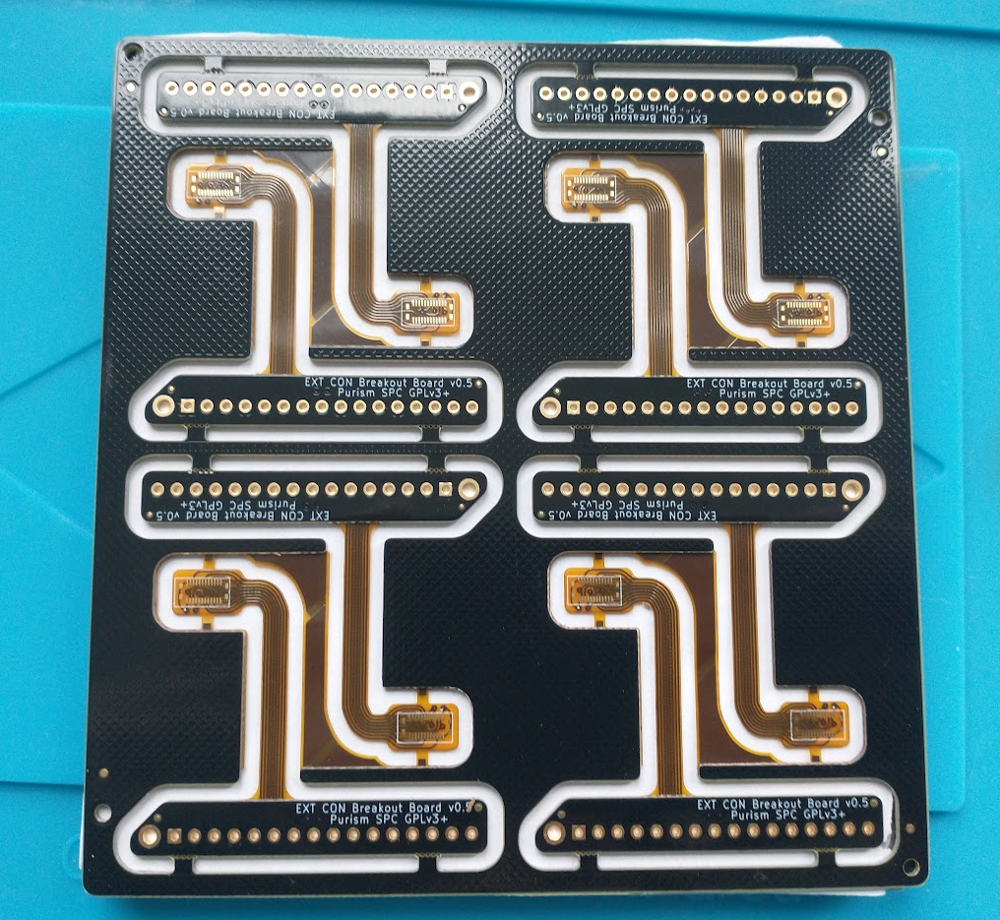
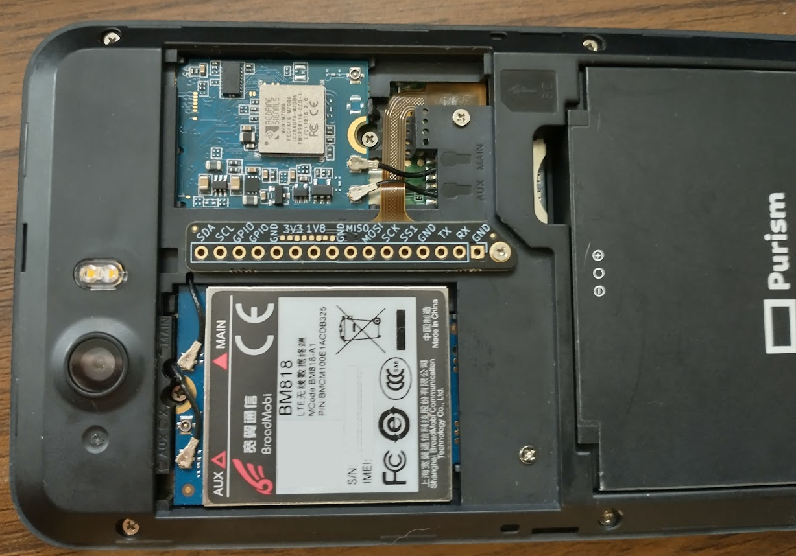

A breakout board for J10 on the Librem 5.

The rigid section has an overall thickness of 1.2mm, the flex section has an overall thickness of flex section is 0.126mm, and the stiffener and its adhesive adds 0.125mm on top of the thickness of the flex.

The first panels were made by PCBWay, if you would like to order these yourself then you can use their product number W159429AS1C23 to reorder the same panel.

The FPC connector used is either Panasonic AXT624124 or OK-06M024-04.

Here is a photo of a v0.5 panel:

Here is a photo of the rigid-flex board mounted inside a Librem 5, using the center M.2 cover screw to fasten the rigid section down:

